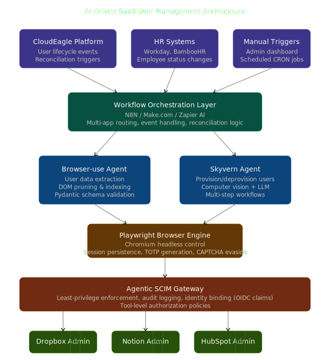

# AI Web Automation POC

## What it does
- Logs into SaaS UI (session reuse)
- Navigates to users page
- Extracts user data

## Tech
- Playwright

## Key Learnings
- UI-based scraping is brittle
- Selectors break frequently
- Data is often incomplete

## Limitations
- No email extraction (not visible in UI)
- Tight coupling to DOM

## Why AI is needed
- Semantic understanding of UI
- Self-healing selectors

## Architecture

### High-Level System

### Scraping Workflow

